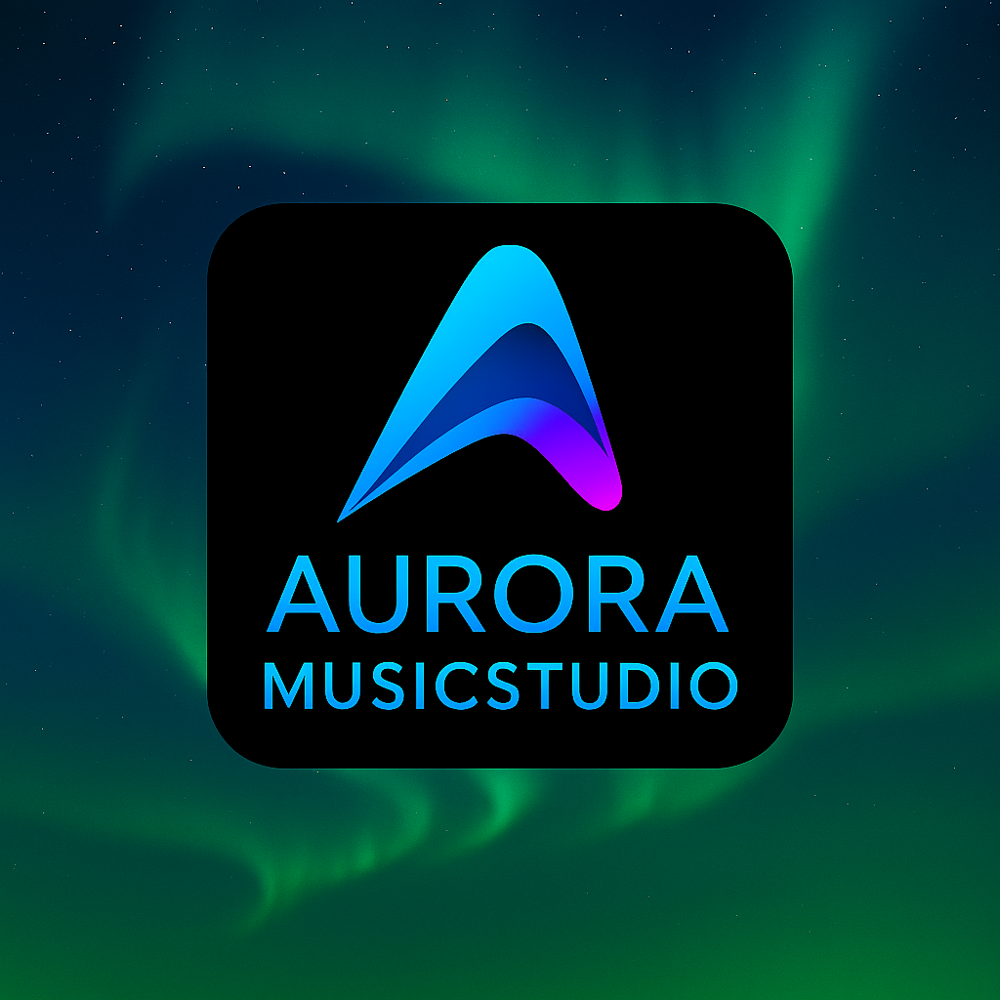

### App Icon

# AuroraMusicStudio  
AI‑powered vocal creation and coaching environment for creators.

---

## 🚀 Vision  
AuroraMusicStudio empowers creators to explore their voice.  
With AI‑driven vocal tools, recording features, and real‑time coaching, the app becomes a portable studio for singers, podcasters, and content creators.

More details: Vision

---

## ✅ Features (MVP)  
🎙️ Multi‑track recording  
🤖 AI vocal coaching  
🎚️ Real‑time effects  
📈 Pitch & timing analysis  
🎛️ Voice presets  
🔐 Secure authentication  

More details: Features

---

## 🧠 Architecture  
AuroraMusicStudio is built on a modular, scalable architecture:

- Mobile App (Flutter)  
- Audio Engine (advanced DSP)  
- AI Layer (coaching, analysis, enhancement)  
- Cloud Storage (optional)  
- Security Layer (auth, encryption)

More details: Architecture

---

## 🔌 AI/Audio Plan  
- Vocal coaching  
- Timing correction  
- Pitch correction  
- Noise reduction  
- Multi‑track mixing  
- Export tools  

More details: AI/Audio Plan

---

## 🖼️ App Icons  
AuroraMusicStudio uses a gradient‑based icon aligned with the Aurora branding system.

All required sizes and formats:  
👉 App Icons Documentation

---

## 🗺️ Roadmap  
✅ Branding  
✅ GitHub setup  
⬜ Upload app icons  
⬜ Finalize MVP  
⬜ Build advanced audio engine  
⬜ Implement AI coaching  
⬜ Start mobile app  
⬜ Beta release  
⬜ Launch v1.0  

More details: Roadmap

---

## 📬 Contact  
Founder: Miguel Marquez‑Tiegs  
GitHub: @AuroraStudiosHQ
